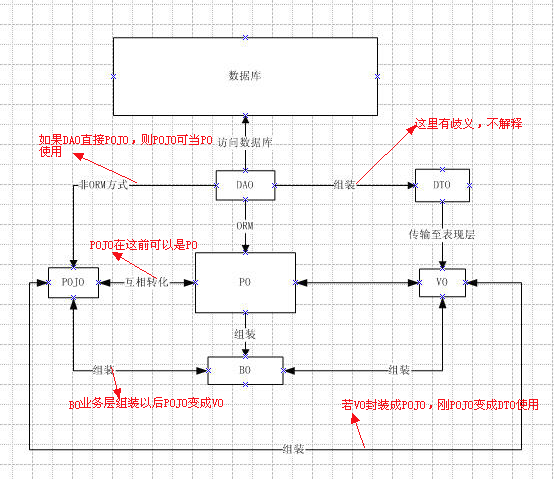
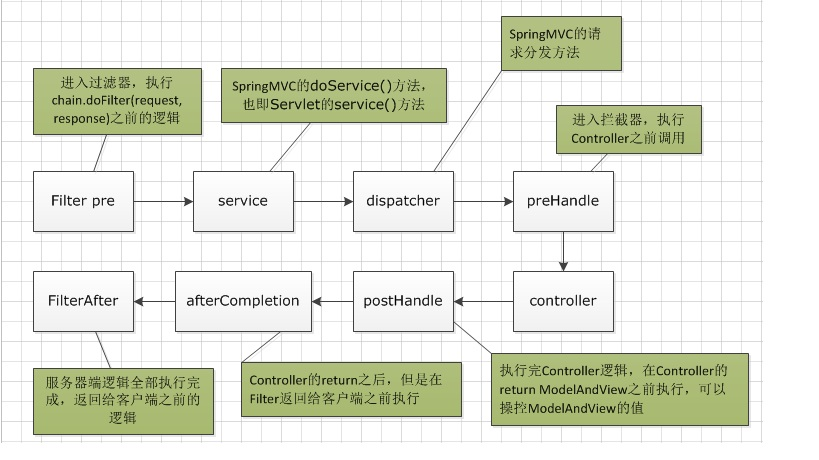

<h1>@Controller和@RestController的区别</h1>

<p style="text-align:right;"><font >2018-11-28<font></p>
	
> @RestController 相当于 @Controller 和 @ResponseBody 合在一起使用
> 
	
	
1. 如果只使用`@RestController`，则`Controller`中的方法无法返回`jsp`页面，或者`html`。配置的视图解析器`InternalResourceViewResolver` 不起作用，返回的内容就是`Return`里的内容。
2. 如果需要返回到指定页面则需要使用`@Controller`配合视图解析器`InternalResourceViewResolver `才行。

	如果需要返回`JSON`、`XML`或者自定义的`mediaType `内容到页面，则需要在对应的方法上加上`@ResponseBody`注解。
	
---

<h1><a href="https://blog.csdn.net/Connie1451/article/details/79975954"> @getMapping、@postMapping，@RequestMapping区别</a></h1>


1. `@GetMapping`是一个组合注解，是`@RequestMapping(method = RequestMethod.GET)`的缩写
2. `@PostMapping`是一个组合注解，是`@RequestMapping(method = RequestMethod.POST)`的缩写

----

<h1><a href="https://www.jianshu.com/p/579ef18709cf">获取当前的请求HttpServletRequest</a></h1>

<h2>Controller中加参数</h2>

```
@Controller
public class TestController{
	@RequestMapping("/test")
	public void test(HttpServletRequest servletRequest){
		......
	}
}
```

`Controller`中获取`reuqest`对象后，如果要在其他方法中使用`request`对象，需要在调用这些方法时将`request`对象作为参数传入。

此时request对象是方法参数，相当于局部变量，毫无疑问是线程安全的。

----

<h1><a href="https://blog.csdn.net/ckc_666/article/details/79239974">@PathVariable 映射 URL 绑定的占位符</a></h1>

- 带占位符的 URL 是 Spring3.0 新增的功能，该功能在SpringMVC 向 REST 目标挺进发展过程中具有里程碑的意义
- 通过 @PathVariable 可以将 URL 中占位符参数绑定到控制器处理方法的入参中：URL 中的 {xxx} 占位符可以通过@PathVariable(“xxx“) 绑定到操作方法的入参中。

```
//@PathVariable可以用来映射URL中的占位符到目标方法的参数中
@RequestMapping("/testPathVariable/{id}")
    public String testPathVariable(@PathVariable("id") Integer id)
    {
        System.out.println("testPathVariable:"+id);
        return SUCCESS;
    }
```

```
<a href="springmvc/testPathVariable/1">testPathVariable</a>

```

<h1><a href="https://www.cnblogs.com/EasonJim/p/7967949.html">Java中PO、BO、VO、DTO、POJO、DAO概念及其作用和项目实例图</a></h1>

- **PO（bean、entity等命名）：**

Persistant Object持久对象，数据库表中的记录在java对象中的显示状态

最形象的理解就是一个PO就是数据库中的一条记录。

好处是可以把一条记录作为一个对象处理，可以方便的转为其它对象。 

- **BO（service、manager、business等命名）：**

Business Object业务对象

主要作用是把业务逻辑封装为一个对象。这个对象可以包括一个或多个其它的对象。

形象描述为一个对象的形为和动作，当然也有涉及到基它对象的一些形为和动作。比如处理

一个人的业务逻辑，有睡觉，吃饭，工作，上班等等形为还有可能和别人发关系的形为。

这样处理业务逻辑时，我们就可以针对BO去处理。

- **VO（from也有此写法） ：**

Value Object值对象

主要体现在视图的对象，对于一个WEB页面将整个页面的属性封装成一个对象。然后用一个VO对象在控制层与视图层进行传输交换。

- **DTO (经过处理后的PO，可能增加或者减少PO的属性)：**

Data Transfer Object数据传输对象

主要用于远程调用等需要大量传输对象的地方。

比如我们一张表有100个字段，那么对应的PO就有100个属性。

但是我们界面上只要显示10个字段，

客户端用WEB service来获取数据，没有必要把整个PO对象传递到客户端，

这时我们就可以用只有这10个属性的DTO来传递结果到客户端，这样也不会暴露服务端表结构.到达客户端以后，如果用这个对象来对应界面显示，那此时它的身份就转为VO 

- **POJO（POJO是一种概念或者接口，身份及作用随环境变化而变化） ：**

POJO有一些Private的参数作为对象的属性。然后针对每个参数定义了get和set方法作为访问的接口

Plain Ordinary Java Object简单Java对象

即POJO是一个简单的普通的Java对象，它不包含业务逻辑或持久逻辑等，但不是JavaBean、EntityBean等，不具有任何特殊角色和不继承或不实现任何其它Java框架的类或接口。

POJO对象有时也被称为Data对象，大量应用于表现现实中的对象。 

一个POJO持久化以后就是PO。

直接用它传递、传递过程中就是DTO

直接用来对应表示层就是VO 



- **DAO（Data Access Object数据访问对象）：**

这个大家最熟悉，和上面几个O区别最大，基本没有互相转化的可能性和必要.

主要用来封装对数据库的访问。通过它可以把POJO持久化为PO，用PO组装出来VO、DTO

- **Controller控制层主要是Action/Servlet等构成（目前Spring MVC则是通过@Controller标签使用）**

此层业务层与视图层打交道的中间层，负责传输VO对象和调用BO层的业务方法，负责视图层请求的数据处理后响应给视图层。

- **View（视图层）**

主要是指由JSP、HTML等文件形成的显示层。

总结一下要用具体的X0需要看具体环境及项目架构，在不同的层、不同的应用场合，对象的身份也不一样，而且对象身份的转化也是很自然的。就像你对老婆来说就是老公，对父母来说就是子女。设计这些概念的初衷不是为了唬人而是为了更好的理解和处理各种逻辑，让大家能更好的去用面向对象的方式处理问题。

---

<h1><a href="https://blog.csdn.net/cs_hnu_scw/article/details/80718467">手把手教你如何玩转插件：分页插件（Pagehelper）</a></h1>

> 问题：如果运行时出现，org.springframework.beans.factory.BeanCreationException: Error creating bean with name 'com.github.pagehelper.autoconfigure.PageHelperAutoConfiguration': 这个错误。
> 

<font color="#f00">解决办法：这是由于分页插件pagehelper的版本和mybatis不兼容的原因，修改分页插件的版本即可。</font>

----

<h1><a href="http://www.importnew.com/29401.html">SpringBoot 拦截器</a></h1>

>在实际开发过程中，经常会碰见一些比如系统启动初始化信息、统计在线人数、在线用户数、过滤敏高词汇、访问权限控制(URL级别)等业务需求。这些对于业务来说一般上是无关的，业务方是无需关系的，业务只需要关系自己内部业务的事情。所以一般上实现以上的功能，都会或多或少的用到过滤器、监听器、拦截器来实现以上功能。

**编写自定义拦截器类**

```
public class MyInterceptor implements HandlerInterceptor {

    @Override
    public boolean preHandle(HttpServletRequest request, HttpServletResponse response, Object handler) throws Exception {
        //只有返回true才会继续向下执行，返回false取消当前请求
        System.out.println("myinterc prehandler");
        return true;
    }

    @Override
    public void postHandle(HttpServletRequest request, HttpServletResponse response, Object handler, @Nullable ModelAndView modelAndView) throws Exception {
        System.out.println("myinterc posthandler");
    }

    @Override
    public void afterCompletion(HttpServletRequest request, HttpServletResponse response, Object handler, @Nullable Exception ex) throws Exception {
        System.out.println("myinterc aftercompletion");
    }
}
```
- preHandle：在业务处理器处理请求之前被调用。预处理，可以进行编码、安全控制、权限校验等处理；
- postHandle：在业务处理器处理请求执行完成后，生成视图之前执行。后处理（调用了Service并返回ModelAndView，但未进行页面渲染），有机会修改ModelAndView 
- afterCompletion：在DispatcherServlet完全处理完请求后被调用，可用于清理资源等。返回处理（已经渲染了页面）；


**通过继承WebMvcConfigurerAdapter注册拦截器**

```
@Configuration
public class MyAdapter extends WebMvcConfigurerAdapter {

    @Override
    public void addInterceptors(InterceptorRegistry registry) {
        //添加拦截器
        registry.addInterceptor(new MyInterceptor())
                .addPathPatterns("/**");
        super.addInterceptors(registry);
    }
}

```
**请求链路说明**



---

<h1><a href="https://blog.csdn.net/long476964/article/details/80626930">@Configuration</a></h1>

> @Component和@Configuration都可以作为配置类。
> 
> @Component注解的范围最广，所有类都可以注解，但是@Configuration注解一般注解在这样的类上：这个类里面有@Value注解的成员变量和@Bean注解的方法，就是一个配置类

-----

<h1>@Component</h1>

> @component （把普通pojo实例化到spring容器中，相当于配置文件中的 
<bean id="" class=""/>）

- 泛指各种组件，就是说当我们的类不属于各种归类的时候（不属于@Controller、@Services等的时候），我们就可以使用@Component来标注这个类


----

<h1><a href="https://blog.csdn.net/py_tamir/article/details/80957484">selectByExample和selectByExampleWithBLOBs有何区别</a></h1>

- 两个方法的返回的resultMap 不同

	>selectByExample  方法返回：BaseResultMap
	
	>selectByExampleWithBLOBs  方法返回：ResultMapWithBLOBs
	
	>ResultMapWithBLOBs 定义时，继承了BaseResultMap，并且自己特殊的字段，该字段通常是longvarchar类型，

- 使用场景不同

	> 若检索大字段时，则需要使用selectByExampleWithBLOBs  ，一般情况则使用selectByExample  即可。


-----

<h1><a href="https://blog.csdn.net/a670941001/article/details/54619432">Mybatis中updateByPrimaryKeySelective和updateByPrimaryKey区别</a></h1>

- int updateByPrimaryKeySelective(TbItem record);

	updateByPrimaryKeySelective会对字段进行判断再更新(如果为Null就忽略更新)，如果你只想更新某一字段，可以用这个方法
	
- int updateByPrimaryKey(TbItem record);

	updateByPrimaryKey对你注入的字段全部更新

-----

<h1><a href="https://blog.csdn.net/nextyu/article/details/78669997">使用 @Transactional 注解配置事务管理</a></h1>

>事务管理是应用系统开发中必不可少的一部分。Spring 为事务管理提供了丰富的功能支持。Spring 事务管理分为编程式和声明式的两种方式。编程式事务指的是通过编码方式实现事务；声明式事务基于 AOP,将具体业务逻辑与事务处理解耦。声明式事务管理使业务代码逻辑不受污染, 因此在实际使用中声明式事务用的比较多。声明式事务有两种方式，一种是在配置文件（xml）中做相关的事务规则声明，另一种是基于 @Transactional 注解的方式。本文将着重介绍基于 @Transactional 注解的事务管理。

